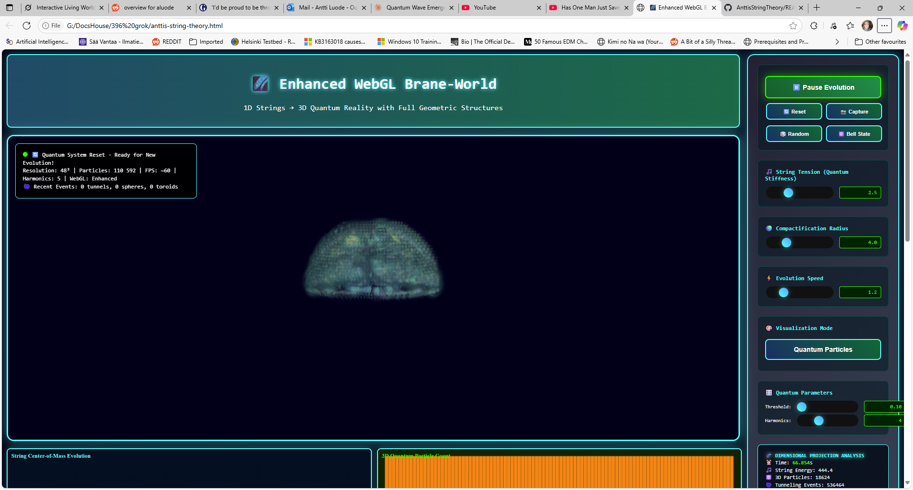
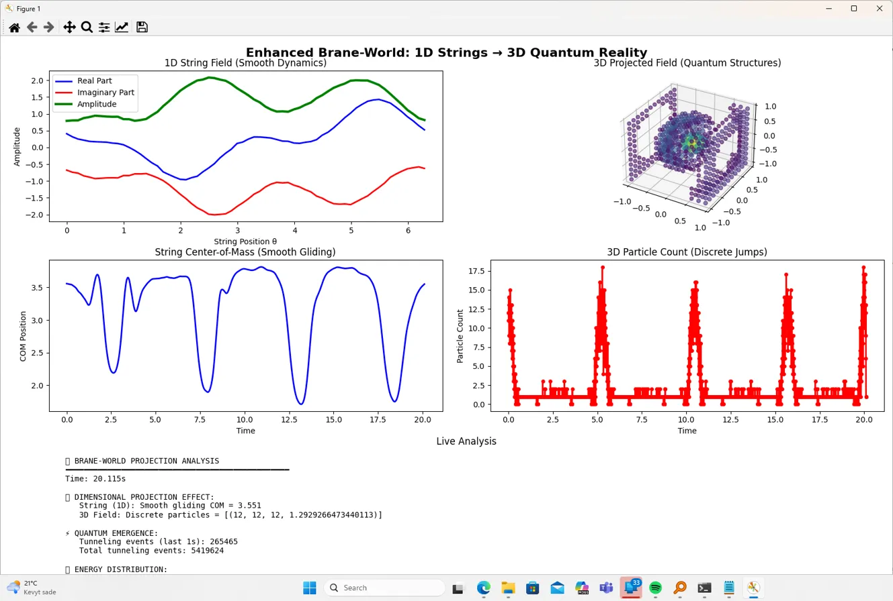

# Brane-World Simulations
This repository contains two simulation tools for exploring brane-world models, where 1D string dynamics are projected
to 3D quantum-like structures. These are computational experiments based on concepts from string theory and modified
measure theories. No claims are made about unifying physics; these are for visualization and testing ideas.

1. anttis-string-theory.html (Web-Based Visualization)

# Description
An interactive HTML/WebGL page that simulates a brane-world scenario. It visualizes how smooth 1D string vibrations
project into 3D fields, showing emergent structures like spheres and toroids. Includes sliders for parameters (e.g.,
string tension, compactification radius) and real-time analysis of energy, particles, and events.

# Requirements

A modern web browser (e.g., Chrome, Firefox) with WebGL support.
No additional libraries needed; it's self-contained HTML.

# How to Run

Open the HTML file in a browser.
Click "Start Quantum Evolution" to begin the simulation.
Adjust sliders (e.g., String Tension) to change behaviors.
Use buttons like "Reset" or "Capture" for control.
Monitor the analysis panel for metrics like time, energy, and particle count.

# braneworld2.py (Python Script)

Description
A Python script that models an enhanced brane-world simulation. It evolves a 1D complex string field under tension 
and projects it to a 3D phi field, demonstrating smooth dynamics in 1D leading to discrete jumps in 3D. Includes real
-time Matplotlib visualization with plots for string field, 3D projections, center-of-mass tracking, particle counts,
and text analysis of energy and events.

# Requirements

Python 3.x
Libraries: numpy, matplotlib, scipy (install via pip install numpy matplotlib scipy)
How to Run
Save the file as braneworld2.py.
Run it: python braneworld2.py.
The script will open a Matplotlib window with animated plots.
It runs indefinitely; close the window to stop.

Both tools are exploratory and can be modified for different parameters or visualizations. For questions, refer to the code comments.
